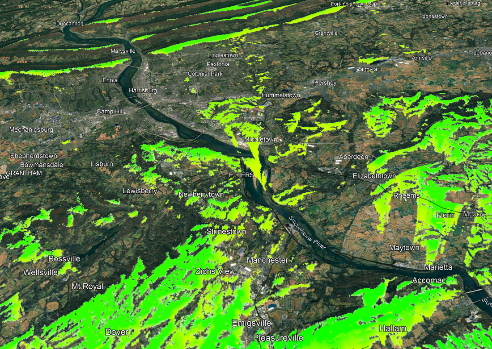

The Susquehanna Valley Mesh `RF-sim` is a collection of scripts and LeafletJS to make a nice map that shows RF coverage. 

Designed for Ubuntu, Debian or Armbian. You should be able to easily port to other OS. 

WARNING: This is still very much in beta state. Do not use without some Linux knowledge/experience.
30m is broken, 90m works great. Python script works, web app works. You can view live version at [https://susme.sh](https://susme.sh)

**Usage**
---

```shell
sudo chmod +x gensite.sh
dos2unix gensite.sh
./gensite.sh
```


**Installation Options**
---

https://www.viewfinderpanoramas.org/Coverage%20map%20viewfinderpanoramas_org3.htm

Download your areas, unzip, put HGT files into one folder.

```shell

#	Install dependencies
sudo apt install g++ cmake libbz2-dev gdal-bin python3-gdal libspdlog-dev zlib1g-dev splat zip dos2unix bc git

#	Get code
git clone https://github.com/W3AXL/Signal-Server.git
cd Signal-Server

#	Build instructions
mkdir build
cd build
cmake ../src
make
#	ignore warnings

#	For 30m high-resolution data, this will take overnight.
#for file in /Path/to/Folder/*.hgt; do
#    srtm2sdf-hd "$file"
#done

#	For 90m high-resolution data, this is faster and good enough for most scenarios. Still will take hours
#   Change folder name
for file in /Path/to/Folder/*.hgt; do
   srtm2sdf "$file"
done

# Move the sdf files to whatever folder you put as SDF_DIR

#	If you need to switch : to _ , use this 
#cd /mnt/c/scripts/signalserver/data/SRTM1 && for f in *:*; do mv "$f" "${f//:/_}"; done
```


**Configuration Options**
---

Go to CONFIGURATION section in script and adjust variables. This uses [Signal-Server](https://github.com/W3AXL/Signal-Server), which is an upgrade of SPLAT from the 90's. 

While this tool is intended for Meshtastic or Meshcore, you can use it for any frequency between 20MHz to 100GHz. Please do not use in polar regions.

Bare minimum is updating TX_LAT, TX_LONG, TX_HEIGHT, TX_FREQ, TX_POWER_WATTS and TX_ANTENNA_DBI

90m is working. 30m is still in progress. So leave RESOLUTION alone. 

**Example Output**
---

```shell
===============================================================================
                    SVM Signal-Server RF Coverage Map Generator
===============================================================================

[INFO] Checking dependencies...
[INFO] Using standard binary for 1200 resolution (90m SRTM3 data)
[INFO] INFO - 1200 resolution uses standard .sdf files (converted with srtm2sdf)
[INFO] Calculating coverage bounds...
[INFO] Bounds: N=41.162755, S=39.366133, E=-75.706378, W=-78.060844
[INFO] Running Signal-Server...
Command: /mnt/c/scripts/signalserver/build/signalserver -sdf /mnt/c/scripts/signalserver/data/SRTM1 -color /mnt/c/scripts/signalserver/M4_dBm.dcf -lat 40.264444 -lon -76.883611 -txh 10 -f 906.875 -erp 3.97 -rxh 2 -rt -120 -pm 1 -rel 50 -conf 50 -R 100 -res 1200 -m -dbm -dbg -o /mnt/c/scripts/signalserver/sites/Harrisburg
[2026-01-28 09:20:14.168] [info]
  ____  _                   _      ____
 / ___|(_) __ _ _ __   __ _| |    / ___|  ___ _ ____   _____ _ __
 \___ \| |/ _` | '_ \ / _` | |____\___ \ / _ \ '__\ \ / / _ \ '__|
  ___) | | (_| | | | | (_| | |_____|__) |  __/ |   \ V /  __/ |
 |____/|_|\__, |_| |_|\__,_|_|    |____/ \___|_|    \_/ \___|_|
          |___/

[2026-01-28 09:20:14.169] [info] Version 4.0 (master defdc59)
[2026-01-28 09:20:14.169] [info]     Compile date: Jan 23 2026 15:25:44
[2026-01-28 09:20:14.169] [info]     Built for 100 DEM tiles at 1200 pixels
[2026-01-28 09:20:14.169] [info]
[2026-01-28 09:20:14.446] [debug] Debug logging enabled
[2026-01-28 09:20:14.446] [debug] Appending / to SDF directory
[2026-01-28 09:20:14.446] [info] -------------------------------- Plot Information --------------------------------
[2026-01-28 09:20:14.446] [info]     TX site parameters: 40.264444N, 76.883611W, 33 ft AGL
[2026-01-28 09:20:14.446] [info]     Plot parameters: 62.14-mile radius, resolution of 1200 ppd
[2026-01-28 09:20:14.446] [info]     Model parameters: 906.875 MHz at 3.97 W EIRP (dBd), 50% confidence
[2026-01-28 09:20:14.446] [info]     Map segments: 4
[2026-01-28 09:20:14.446] [info]     Metric mode
[2026-01-28 09:20:14.446] [info]     Using threaded processing
[2026-01-28 09:20:14.446] [info]
[2026-01-28 09:20:14.446] [info]     Directories:
[2026-01-28 09:20:14.446] [info]         SDF: /mnt/c/scripts/signalserver/data/SRTM1/
[2026-01-28 09:20:14.446] [info] ----------------------------------------------------------------------------------
[2026-01-28 09:20:14.446] [debug] Radius of 62.137 mi is approx 1.175592 deg EW and 0.900579 deg NS
[2026-01-28 09:20:14.446] [debug] Calculated plot bounaries: 39.363865N 75.708019W to 41.165023N 78.059203W
[2026-01-28 09:20:14.446] [info] Loading topo data for boundaries: (39.363865N, 75.708019W) to (41.165023N, 78.059203W)
[2026-01-28 09:20:17.814] [info] [  6%] Processing 602/9964 points
[2026-01-28 09:20:18.314] [info] [ 11%] Processing 1160/9964 points
[2026-01-28 09:20:18.814] [info] [ 16%] Processing 1624/9964 points
[2026-01-28 09:20:19.314] [info] [ 20%] Processing 2076/9964 points
[2026-01-28 09:20:19.814] [info] [ 25%] Processing 2520/9964 points
[2026-01-28 09:20:20.314] [info] [ 29%] Processing 2944/9964 points
[2026-01-28 09:20:20.815] [info] [ 33%] Processing 3344/9964 points
[2026-01-28 09:20:21.315] [info] [ 37%] Processing 3712/9964 points
[2026-01-28 09:20:21.815] [info] [ 40%] Processing 4081/9964 points
[2026-01-28 09:20:22.315] [info] [ 44%] Processing 4445/9964 points
[2026-01-28 09:20:22.815] [info] [ 48%] Processing 4792/9964 points
[2026-01-28 09:20:23.315] [info] [ 51%] Processing 5140/9964 points
[2026-01-28 09:20:23.816] [info] [ 55%] Processing 5485/9964 points
[2026-01-28 09:20:24.316] [info] [ 58%] Processing 5830/9964 points
[2026-01-28 09:20:24.816] [info] [ 62%] Processing 6185/9964 points
[2026-01-28 09:20:25.316] [info] [ 65%] Processing 6555/9964 points
[2026-01-28 09:20:25.816] [info] [ 69%] Processing 6938/9964 points
[2026-01-28 09:20:26.316] [info] [ 73%] Processing 7332/9964 points
[2026-01-28 09:20:26.817] [info] [ 77%] Processing 7748/9964 points
[2026-01-28 09:20:27.317] [info] [ 82%] Processing 8197/9964 points
[2026-01-28 09:20:27.817] [info] [ 86%] Processing 8662/9964 points
[2026-01-28 09:20:28.317] [info] [ 90%] Processing 9040/9964 points
[2026-01-28 09:20:28.817] [info] [ 94%] Processing 9433/9964 points
[2026-01-28 09:20:29.317] [info] [ 96%] Processing 9664/9964 points
[2026-01-28 09:20:29.818] [info] [ 99%] Processing 9901/9964 points
[2026-01-28 09:20:30.318] [info] [ 100%] Processing 9968/9964 points
[2026-01-28 09:20:30.318] [debug] Finished PlotPropagation()
[2026-01-28 09:20:30.318] [debug] Cropping 1: max_west: 78.0619 cropLat: 0.9000 cropLon: 1.1783 longitude: 76.88361 dpp 0.0008333
[2026-01-28 09:20:30.318] [debug] Cropping 2: max_west: 78.0619 cropLat: 0.9000 cropLon: 1.1783333 longitude: 76.88361 width %d
[2026-01-28 09:20:30.653] [info] Area boundaries:41.164443 | -75.705278 | 39.364445 | -78.061944
[INFO] Signal-Server completed successfully
[INFO] Converting PPM to transparent PNG using GDAL...
Input file size is 2828, 2159
0...10...20...30...40...50...60...70...80...90...100 - done.
[INFO] PNG created: /mnt/c/scripts/signalserver/sites/Harrisburg.png
[INFO] Creating KML file...
[INFO] KML created: /mnt/c/scripts/signalserver/sites/Harrisburg.kml
[INFO] Creating KMZ file...
[INFO] KMZ created: /mnt/c/scripts/signalserver/sites/Harrisburg.kmz

===============================================================================
                           RF Coverage Map Complete
===============================================================================

  Site Name:      Harrisburg
  Location:       40.264444, -76.883611
  Frequency:      906.875 MHz
  ERP:            3.97 W
  TX Height:      10 m
  Radius:         100 km
  Threshold:      -120 dBm
  Model:          1
  Resolution:     1200 ppd (Standard 90m)

  Output Files:
    PNG:          /mnt/c/scripts/signalserver/sites/Harrisburg.png
    KML:          /mnt/c/scripts/signalserver/sites/Harrisburg.kml
    KMZ:          /mnt/c/scripts/signalserver/sites/Harrisburg.kmz
    PPM:          /mnt/c/scripts/signalserver/sites/Harrisburg.ppm

===============================================================================
```

**KML to Webapp**
---

Dump kml_2_leaflet.py in a folder with the KML's and PNG's.

```shell
./kml_2_leaflet.py -i . -o leaflet_data
```

Under the example LeafletJS webapp, you'll see a folder called potential. Dump the output there. 

index.json at the root of "potential" folder is just a list of the sites. You'll need to list all of your sites in it. 
Each site has a manifest.json , which leaflet uses to create an individual pin. 

You can create multiple folders, which individual index.json's. Each its own category, with color coded pins. You can link to manifest.json in different folders. 

Update // Put your token here: const MAPBOX_TOKEN = "CHANGE_API_KEY_HERE";

You can get the key from https://www.mapbox.com/ , it's used for LOS pathing functionality.

**How to Contribute**
---

You can clone and submit pull requests. Or look for me on Meshtastic or Meshcore discord. Same username as here. 

**Acknowledgements**
---

Maybe JSON if he helps out, he's a GIS nerd. 

**Donations**
---

This is free, open-source software. Donate a refreshing beverage to your local mesh. 